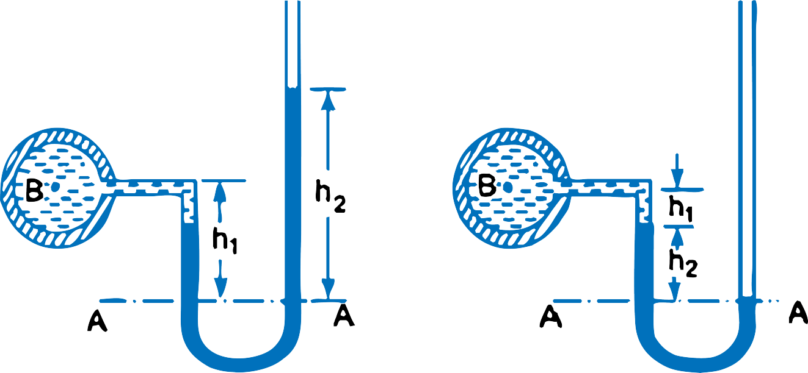

<h3>U-tube Manometer</h3>

It consists of glass tube bend in U-shape, one end of which is connected to a point at which pressure is to be measured and other end remains open to the atmosphere as shown in figure 1(a). The tuve generally contains mercurt or any other liquid whose specific gravity is greater than the specific gravity of the liquid whose pressure is to be measured.

$$ Figure\ 1a\ and\ Figure\ 1b $$

<ol type='a'>

<li><strong>For Gauge Pressure:</strong> Let B is the point at which pressure is to be measured, whose value is p. The datum line is A-A.   

Let, 

h1 = Height of light liquid above the datum line  
h2 = Height of heavy liquid above the datum line  
S1 = Specific gravity of light liquid  
&rho;1 = Density of light liquid = 1000 &times; S1  
S2 = Specific gravity of heavy liquid  
&rho;2 = Density of heavy liquid = 1000 &times; S2    

As the pressure is the same for horizontal surface. Hence pressure above the horizontal datum line A-A in the left column and in the of U-tube manometer should be same.

$$ Pressure\ above\ A-A\ in\ the\ left\ column\ = p + \rho_1 \times g \times h_1 $$

$$ Pressure\ above\ A-A\ in\ the\ right\ column\ = \rho_2 \times g \times h_2 $$

$$ Hence\ equating\ two\ pressures\ => \ \ \ \ p + \rho_1  g  h_1 = \rho_2 g h_2  $$

$$ \therefore \ \ \ \ \ \ p = \rho_2 g h_2 - \rho_1  g  h_1 $$

</li>

<li>
<strong>For Vaccume Pressure: </strong> For measuring vaccume pressure, the level of the heavy liquid in the manometer will be as shown in figure 1(b). 

$$ Pressure\ above\ A-A\ in\ the\ left\ column\ = \rho_2 g h_2 + \rho_1 g h_1 + p $$

$$ Pressure\ head\ in\ the\ right\ column\ above\ A-A  = 0 $$

$$ \rho_2 g h_2 + \rho_1 g h_1 + p  = 0 $$

$$ \therefore \ \ \ \ \ \ \ p = -(\rho_2 g h_2 + \rho_1 g h_2) $$

</li>

</ol>